# 08 — Flowchart & ERD

Diagram sistem Vertiqo dalam format [Mermaid](https://mermaid.js.org) (dirender otomatis oleh GitHub/GitLab dan VS Code
dengan ekstensi *Markdown Preview Mermaid Support*). Sumber kebenaran tetap kode: migration di `database/migrations/`,
service di `app/Services/`. Ringkasan tabel per kolom ada di [03-database.md](03-database.md), aturan bisnis di
[04-business-rules.md](04-business-rules.md).

Diperbarui: 2 Okt 2026 — mencakup 43 migration (sampai `2026_10_01_190001_create_whatsapp_tables`).

Versi siap bagi: [diagram/Peta-Sistem-Lefaklinik.pdf](diagram/Peta-Sistem-Lefaklinik.pdf) (22 halaman: sampul + daftar isi
yang bisa diklik, panduan membaca, satu diagram per halaman A4–A2) dan satu gambar PNG per diagram di
[diagram/png/](diagram/png/) (`01-arsitektur.png` … `20-erd-integrasi.png`, resolusi 2×), serta versi yang bisa diedit di
draw.io: [diagram/Peta-Sistem-Lefaklinik.drawio](diagram/Peta-Sistem-Lefaklinik.drawio) (20 halaman/tab, bentuk asli draw.io hitam
putih; ERD berupa tabel dengan ujung crow's foot, kotak putus-putus = tabel domain lain). Ketiganya dirender dari blok Mermaid
di file ini — bila blok diubah, render ulang agar PDF, PNG, dan draw.io tidak usang. Berkas-berkas itu dibuat 2 Okt 2026, sebelum
nama produk berganti menjadi Vertiqo (5 Okt 2026), sehingga nama berkas PDF & draw.io masih `Peta-Sistem-Lefaklinik.*` (sengaja tidak
di-rename agar tautan tidak putus); isi diagram tetap berlaku.

**Isi**

1. [Arsitektur sistem](#1-arsitektur-sistem)
2. [Alur pelayanan pasien (end-to-end)](#2-alur-pelayanan-pasien-end-to-end)
3. [Autentikasi & otorisasi request](#3-autentikasi--otorisasi-request)
4. [Proses latar belakang (SATUSEHAT & WhatsApp)](#4-proses-latar-belakang-satusehat--whatsapp)
5. [Diagram status](#5-diagram-status)
6. [ERD](#6-erd) — peta inti + 10 diagram per domain

---

## 1. Arsitektur sistem

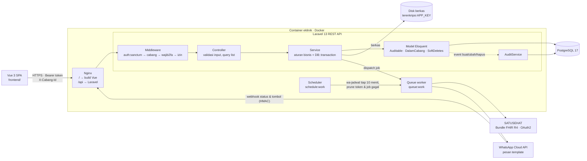
```mermaid
---
config:
  flowchart:
    wrappingWidth: 320
---
flowchart LR
    SPA["Vue 3 SPA<br/>frontend/"]
    subgraph Server["Container eklinik · Docker"]
        NGX["Nginx<br/>/ → build Vue<br/>/api → Laravel"]
        subgraph API["Laravel 13 REST API"]
            MW["Middleware<br/>auth:sanctum → cabang → wajib2fa → izin"]
            CTRL["Controller<br/>validasi input, query list"]
            SVC["Service<br/>aturan bisnis + DB::transaction"]
            MDL["Model Eloquent<br/>Auditable · DalamCabang · SoftDeletes"]
            AUD["AuditService"]
        end
        Q["Queue worker<br/>queue:work"]
        SCH["Scheduler<br/>schedule:work"]
    end
    DB[("PostgreSQL 17")]
    FS[("Disk berkas<br/>terenkripsi APP_KEY")]
    SS["SATUSEHAT<br/>Bundle FHIR R4 · OAuth2"]
    WA["WhatsApp Cloud API<br/>pesan template"]

    SPA -- "HTTPS · Bearer token<br/>X-Cabang-Id" --> NGX
    NGX --> MW --> CTRL --> SVC --> MDL --> DB
    MDL -. "event buat/ubah/hapus" .-> AUD --> DB
    SVC -- "berkas" --> FS
    SVC -- "dispatch job" --> Q
    SCH -- "wa-jadwal tiap 10 menit,<br/>prune token & job gagal" --> Q
    Q --> SS
    Q --> WA
    WA -- "webhook status & tombol (HMAC)" --> NGX
```

- Satu instalasi = satu organisasi klinik dengan banyak cabang. Pasien milik pusat; kunjungan, resep, tagihan, stok, shift kas,
  booking dan komisi milik satu cabang (trait `DalamCabang`).
- Logika bisnis hanya di `app/Services/`; setiap perubahan model `Auditable` tercatat ke `audit_logs` (append-only).

## 2. Alur pelayanan pasien (end-to-end)

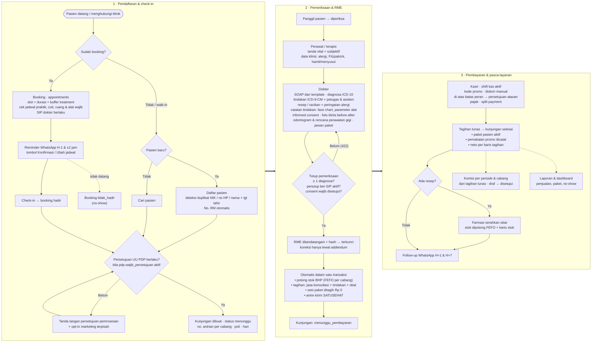
```mermaid
---
config:
  flowchart:
    wrappingWidth: 320
---
flowchart LR
    subgraph FASE1["1 · Pendaftaran & check-in"]
        direction TB
        A(["Pasien datang / menghubungi klinik"]) --> B{"Sudah booking?"}
        B -- "Ya" --> BK["Booking · appointments<br/>slot = durasi + buffer treatment<br/>cek jadwal praktik, cuti, ruang & alat wajib<br/>SIP dokter berlaku"]
        BK --> WA1["Reminder WhatsApp H-1 & ±2 jam<br/>tombol Konfirmasi / Ubah jadwal"]
        WA1 --> CI["Check-in → booking hadir"]
        WA1 -. "tidak datang" .-> NS["Booking tidak_hadir<br/>(no-show)"]
        B -- "Tidak / walk-in" --> P1{"Pasien baru?"}
        P1 -- "Ya" --> P2["Daftar pasien<br/>deteksi duplikat NIK / no HP / nama + tgl lahir<br/>No. RM otomatis"]
        P1 -- "Tidak" --> P3["Cari pasien"]
        P2 --> PDP{"Persetujuan UU PDP berlaku?<br/>bila pdp.wajib_persetujuan aktif"}
        P3 --> PDP
        CI --> PDP
        PDP -- "Belum" --> PDP2["Tanda tangan persetujuan pemrosesan<br/>+ opt-in marketing terpisah"] --> PDP
        PDP -- "Ya" --> K1["Kunjungan dibuat · status menunggu<br/>no. antrian per cabang · poli · hari"]
    end

    subgraph FASE2["2 · Pemeriksaan & RME"]
        direction TB
        K2["Panggil pasien → diperiksa"] --> PR["Perawat / terapis<br/>tanda vital + subjektif<br/>data klinis: alergi, Fitzpatrick, hamil/menyusui"]
        PR --> DR["Dokter<br/>SOAP dari template · diagnosa ICD-10<br/>tindakan ICD-9-CM + petugas & asisten<br/>resep / racikan + peringatan alergi<br/>catatan tindakan: face chart, parameter alat<br/>informed consent · foto klinis before-after<br/>odontogram & rencana perawatan gigi · pesan paket"]
        DR --> T{"Tutup pemeriksaan<br/>≥ 1 diagnosa?<br/>penutup ber-SIP aktif?<br/>consent wajib disetujui?"}
        T -- "Belum (422)" --> DR
        T -- "Ya" --> TTD["RME ditandatangani + hash → terkunci<br/>koreksi hanya lewat addendum"]
        TTD --> AUTO["Otomatis dalam satu transaksi<br/>• potong stok BHP (FEFO per cabang)<br/>• tagihan: jasa konsultasi + tindakan + obat<br/>• sesi paket ditagih Rp 0<br/>• antre kirim SATUSEHAT"]
        AUTO --> MB["Kunjungan: menunggu_pembayaran"]
    end

    subgraph FASE3["3 · Pembayaran & pasca-layanan"]
        direction TB
        KS["Kasir · shift kas aktif<br/>kode promo · diskon manual<br/>di atas batas peran → persetujuan atasan<br/>pajak · split payment"]
        KS --> LN["Tagihan lunas → kunjungan selesai<br/>• paket pasien aktif<br/>• pemakaian promo dicatat<br/>• neto per baris tagihan"]
        LN --> RS{"Ada resep?"}
        RS -- "Ya" --> FR["Farmasi serahkan obat<br/>stok dipotong FEFO + kartu stok"]
        RS -- "Tidak" --> FU
        FR --> FU["Follow-up WhatsApp H+1 & H+7"]
        LN -.-> KM["Komisi per periode & cabang<br/>dari tagihan lunas · draf → disetujui"]
        LN -.-> LP["Laporan & dashboard<br/>penjualan, paket, no-show"]
    end

    FASE1 ==> FASE2 ==> FASE3
```

Catatan alur:

- Tiga kolom = tiga fase berurutan. Fase 1 berakhir saat kunjungan dibuat (`menunggu`), fase 2 dimulai saat pasien dipanggil
  dan berakhir di `menunggu_pembayaran`, fase 3 dimulai di kasir.
- Kunjungan `menunggu` boleh dibatalkan. Tagihan `belum_bayar` bisa di-void, tagihan `lunas` bisa direfund (izin `kasir.void`).
- Penjualan produk/paket tanpa kunjungan memakai **tagihan mandiri** (`tagihans.kunjungan_id` null, `pasien_id` diisi).
- Obat hanya diserahkan setelah tagihan lunas (urutan poli → kasir → farmasi).

## 3. Autentikasi & otorisasi request

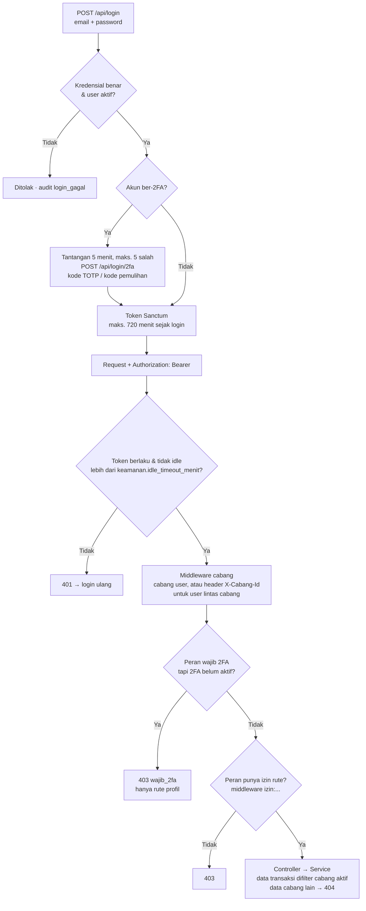
```mermaid
---
config:
  flowchart:
    wrappingWidth: 320
---
flowchart TD
    L["POST /api/login<br/>email + password"] --> V{"Kredensial benar<br/>& user aktif?"}
    V -- "Tidak" --> X1["Ditolak · audit login_gagal"]
    V -- "Ya" --> F{"Akun ber-2FA?"}
    F -- "Ya" --> T2["Tantangan 5 menit, maks. 5 salah<br/>POST /api/login/2fa<br/>kode TOTP / kode pemulihan"]
    T2 --> TK
    F -- "Tidak" --> TK["Token Sanctum<br/>maks. 720 menit sejak login"]

    TK --> R["Request + Authorization: Bearer"]
    R --> M1{"Token berlaku & tidak idle<br/>lebih dari keamanan.idle_timeout_menit?"}
    M1 -- "Tidak" --> X2["401 → login ulang"]
    M1 -- "Ya" --> M2["Middleware cabang<br/>cabang user, atau header X-Cabang-Id<br/>untuk user lintas cabang"]
    M2 --> M3{"Peran wajib 2FA<br/>tapi 2FA belum aktif?"}
    M3 -- "Ya" --> X3["403 wajib_2fa<br/>hanya rute profil"]
    M3 -- "Tidak" --> M4{"Peran punya izin rute?<br/>middleware izin:..."}
    M4 -- "Tidak" --> X4["403"]
    M4 -- "Ya" --> OK["Controller → Service<br/>data transaksi difilter cabang aktif<br/>data cabang lain → 404"]
```

## 4. Proses latar belakang (SATUSEHAT & WhatsApp)

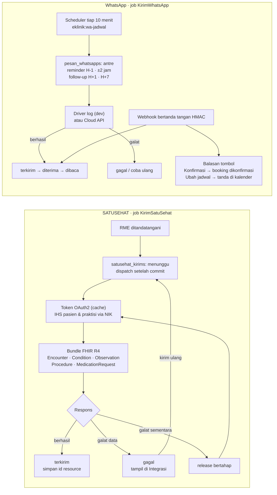
```mermaid
---
config:
  flowchart:
    wrappingWidth: 320
---
flowchart LR
    subgraph SATUSEHAT["SATUSEHAT · job KirimSatuSehat"]
        S1["RME ditandatangani"] --> S2["satusehat_kirims: menunggu<br/>dispatch setelah commit"]
        S2 --> S3["Token OAuth2 (cache)<br/>IHS pasien & praktisi via NIK"]
        S3 --> S4["Bundle FHIR R4<br/>Encounter · Condition · Observation<br/>Procedure · MedicationRequest"]
        S4 --> S5{"Respons"}
        S5 -- "berhasil" --> S6["terkirim<br/>simpan id resource"]
        S5 -- "galat data" --> S7["gagal<br/>tampil di Integrasi"]
        S5 -- "galat sementara" --> S8["release bertahap"] --> S3
        S7 -- "kirim ulang" --> S2
    end

    subgraph WhatsApp["WhatsApp · job KirimWhatsApp"]
        W1["Scheduler tiap 10 menit<br/>eklinik:wa-jadwal"] --> W2["pesan_whatsapps: antre<br/>reminder H-1 · ±2 jam<br/>follow-up H+1 · H+7"]
        W2 --> W3["Driver log (dev)<br/>atau Cloud API"]
        W3 -- "berhasil" --> W4["terkirim → diterima → dibaca"]
        W3 -- "galat" --> W5["gagal / coba ulang"]
        W6["Webhook bertanda tangan HMAC"] --> W4
        W6 --> W7["Balasan tombol<br/>Konfirmasi → booking dikonfirmasi<br/>Ubah jadwal → tanda di kalender"]
    end
```

## 5. Diagram status

Status disimpan sebagai string dan di-cast ke Enum (`app/Enums/`).

### Kunjungan (`StatusKunjungan`)

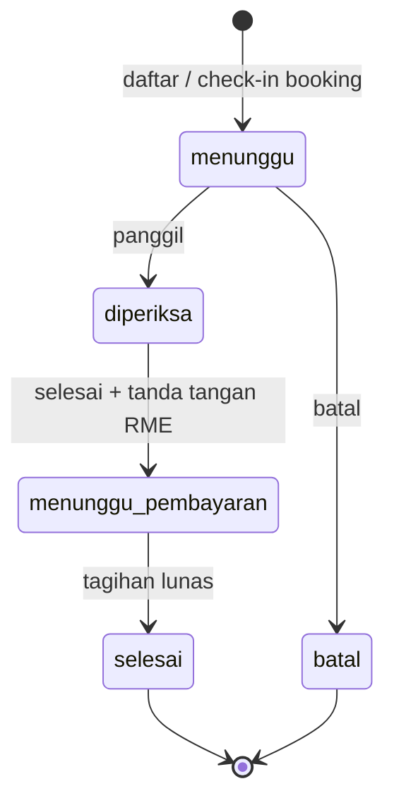
```mermaid
stateDiagram-v2
    [*] --> menunggu: daftar / check-in booking
    menunggu --> batal: batal
    menunggu --> diperiksa: panggil
    diperiksa --> menunggu_pembayaran: selesai + tanda tangan RME
    menunggu_pembayaran --> selesai: tagihan lunas
    selesai --> [*]
    batal --> [*]
```

### Booking (`StatusAppointment`)

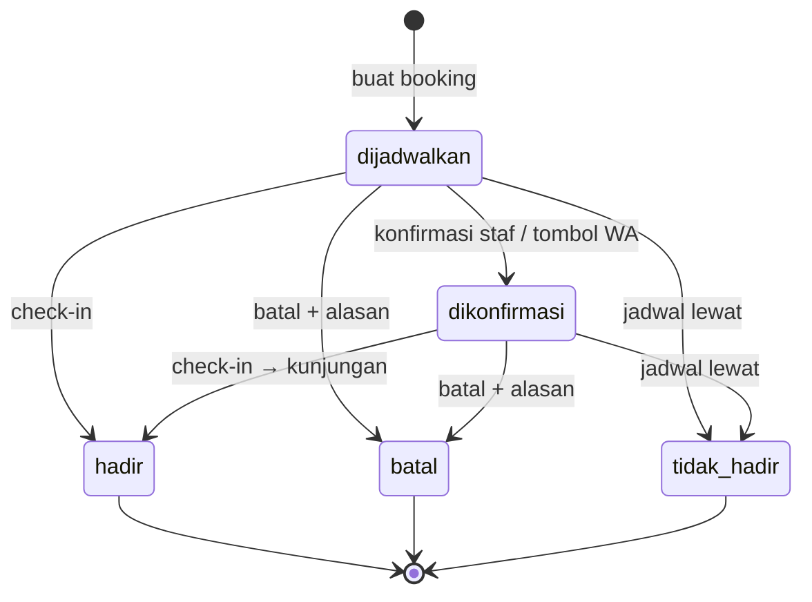
```mermaid
stateDiagram-v2
    [*] --> dijadwalkan: buat booking
    dijadwalkan --> dikonfirmasi: konfirmasi staf / tombol WA
    dijadwalkan --> hadir: check-in
    dikonfirmasi --> hadir: check-in → kunjungan
    dijadwalkan --> batal: batal + alasan
    dikonfirmasi --> batal: batal + alasan
    dijadwalkan --> tidak_hadir: jadwal lewat
    dikonfirmasi --> tidak_hadir: jadwal lewat
    hadir --> [*]
    batal --> [*]
    tidak_hadir --> [*]
```

### Tagihan (`StatusTagihan`) & resep (`StatusResep`)

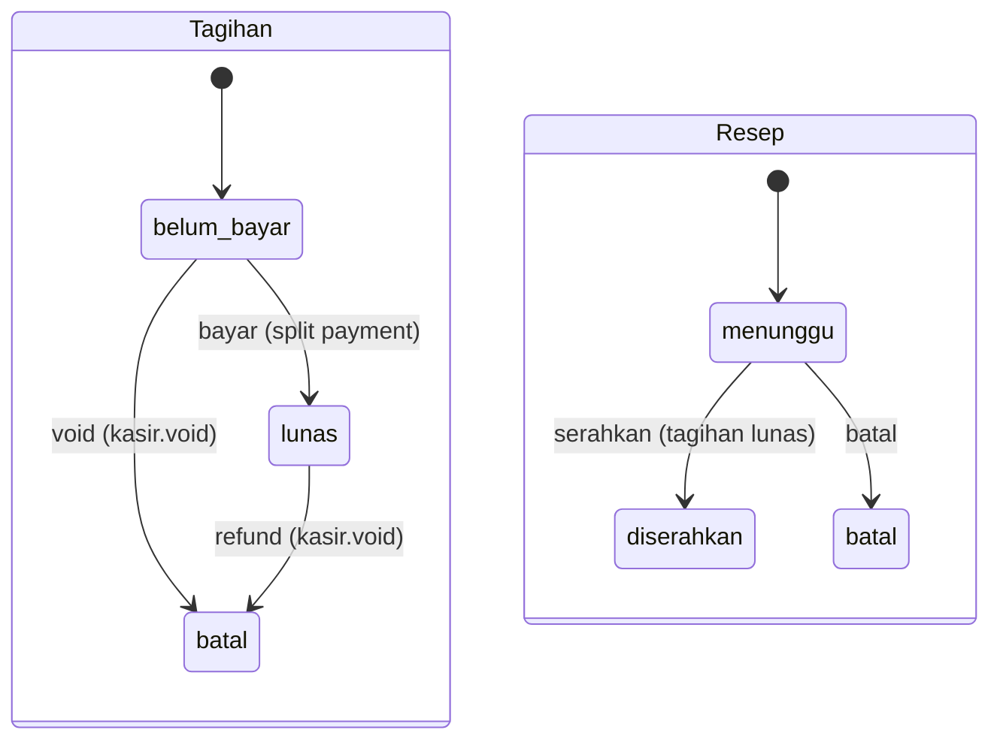
```mermaid
stateDiagram-v2
    state Tagihan {
        [*] --> belum_bayar
        belum_bayar --> lunas: bayar (split payment)
        belum_bayar --> batal: void (kasir.void)
        lunas --> batal: refund (kasir.void)
    }
    state Resep {
        state "menunggu" as r_menunggu
        state "batal" as r_batal
        [*] --> r_menunggu
        r_menunggu --> diserahkan: serahkan (tagihan lunas)
        r_menunggu --> r_batal: batal
    }
```

### Paket pasien (`StatusPaketPasien`)

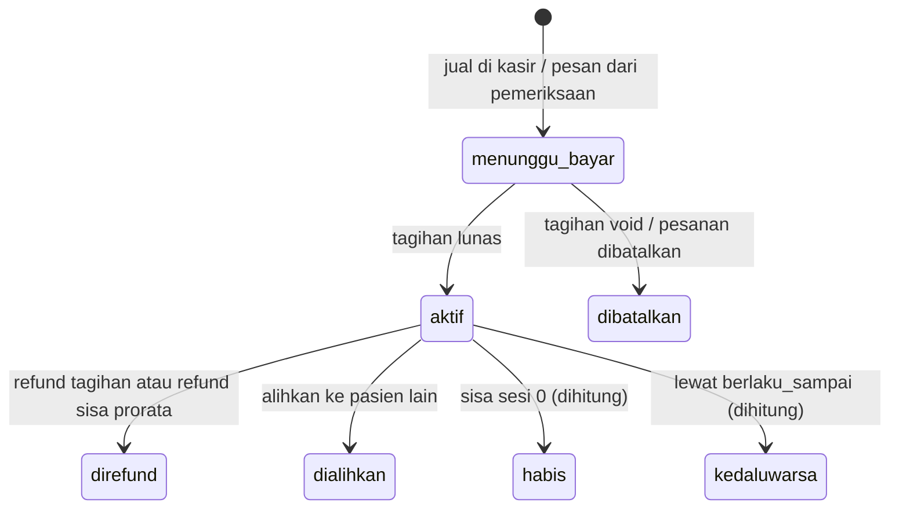
```mermaid
stateDiagram-v2
    [*] --> menunggu_bayar: jual di kasir / pesan dari pemeriksaan
    menunggu_bayar --> aktif: tagihan lunas
    menunggu_bayar --> dibatalkan: tagihan void / pesanan dibatalkan
    aktif --> direfund: refund tagihan atau refund sisa prorata
    aktif --> dialihkan: alihkan ke pasien lain
    aktif --> habis: sisa sesi 0 (dihitung)
    aktif --> kedaluwarsa: lewat berlaku_sampai (dihitung)
```

`habis` dan `kedaluwarsa` tidak disimpan — dihitung dari pemakaian sesi & tanggal (`PaketPasien::statusEfektif`).

### Rencana perawatan gigi, periode komisi, persetujuan

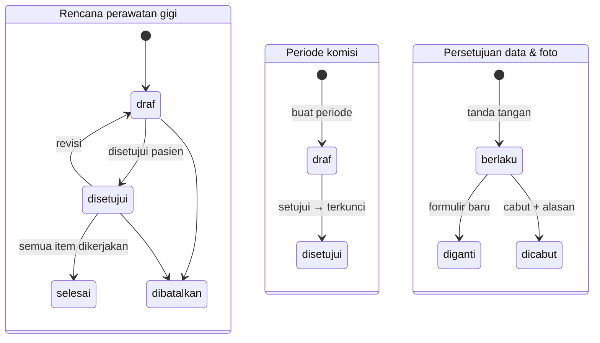
```mermaid
stateDiagram-v2
    state "Rencana perawatan gigi" as RencanaPerawatan
    state "Periode komisi" as KomisiPeriode
    state "Persetujuan data & foto" as Persetujuan
    state RencanaPerawatan {
        [*] --> draf
        draf --> disetujui: disetujui pasien
        disetujui --> draf: revisi
        disetujui --> selesai: semua item dikerjakan
        draf --> dibatalkan
        disetujui --> dibatalkan
    }
    state KomisiPeriode {
        state "draf" as k_draf
        state "disetujui" as k_disetujui
        [*] --> k_draf: buat periode
        k_draf --> k_disetujui: setujui → terkunci
    }
    state Persetujuan {
        [*] --> berlaku: tanda tangan
        berlaku --> diganti: formulir baru
        berlaku --> dicabut: cabut + alasan
    }
```

Rencana perawatan: saat disetujui pasien estimasi biaya dikunci; perubahan lewat revisi (kembali ke `draf`). Periode komisi:
hitung ulang & penyesuaian hanya selama `draf`; setelah disetujui terkunci. Informed consent: `disetujui` / `ditolak` saat ditandatangani, lalu bisa `dicabut`. Consent, persetujuan, dan addendum
tidak pernah dihapus.

---

## 6. ERD

Notasi Mermaid: `||--o{` satu ke nol-atau-banyak (FK wajib), `|o--o{` FK nullable, `||--o|` satu ke nol-atau-satu
(FK unik). Entitas tanpa atribut di sebuah diagram adalah rujukan ke domain lain. Kolom audit `created_at`/`updated_at`
dihilangkan; `deleted_at` ditulis bila tabel memakai soft delete. Semua nominal uang = integer rupiah.

### 6.0 Peta relasi inti

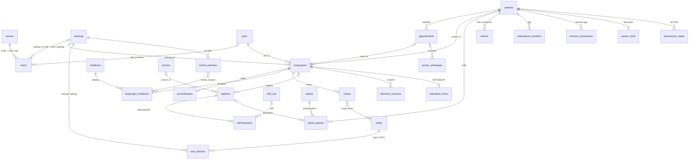
```mermaid
erDiagram
    perans ||--o{ users : "kode = users.role"
    cabangs |o--o{ users : "cabang_id (null = lintas cabang)"
    polis |o--o{ users : "poli_id dokter"
    pasiens ||--o{ appointments : "booking"
    appointments |o--o| kunjungans : "check-in"
    pasiens ||--o{ kunjungans : "pasien_id"
    polis ||--o{ kunjungans : "poli_id"
    cabangs ||--o{ kunjungans : "cabang_id"
    kunjungans ||--o| pemeriksaans : "RME"
    kunjungans ||--o{ kunjungan_tindakans : "tindakan"
    tindakans ||--o{ kunjungan_tindakans : "katalog"
    kunjungans ||--o{ reseps : "resep"
    reseps }o--o{ obats : "resep_items"
    kunjungans |o--o{ tagihans : "tagihan"
    tagihans ||--o{ pembayarans : "split payment"
    shift_kas |o--o{ pembayarans : "shift"
    obats ||--o{ stok_batches : "batch FEFO"
    cabangs ||--o{ stok_batches : "stok per cabang"
    pakets ||--o{ paket_pasiens : "katalog paket"
    pasiens ||--o{ paket_pasiens : "milik"
    tagihans |o--o{ paket_pasiens : "penjualan"
    promos |o--o{ tagihans : "promo_id"
    cabangs ||--o{ komisi_periodes : "periode"
    komisi_periodes }o--o{ kunjungan_tindakans : "komisi_barises"
    pasiens ||--o{ berkas : "foto & lampiran"
    kunjungans ||--o{ informed_consents : "consent"
    pasiens ||--o{ odontogram_kondisis : "gigi"
    pasiens ||--o{ rencana_perawatans : "rencana gigi"
    pasiens ||--o| pasien_klinis : "data klinis"
    pasiens ||--o{ persetujuan_datas : "UU PDP"
    kunjungans ||--o| satusehat_kirims : "SATUSEHAT"
    appointments |o--o{ pesan_whatsapps : "reminder"
```

### 6.1 Organisasi, akses & sistem

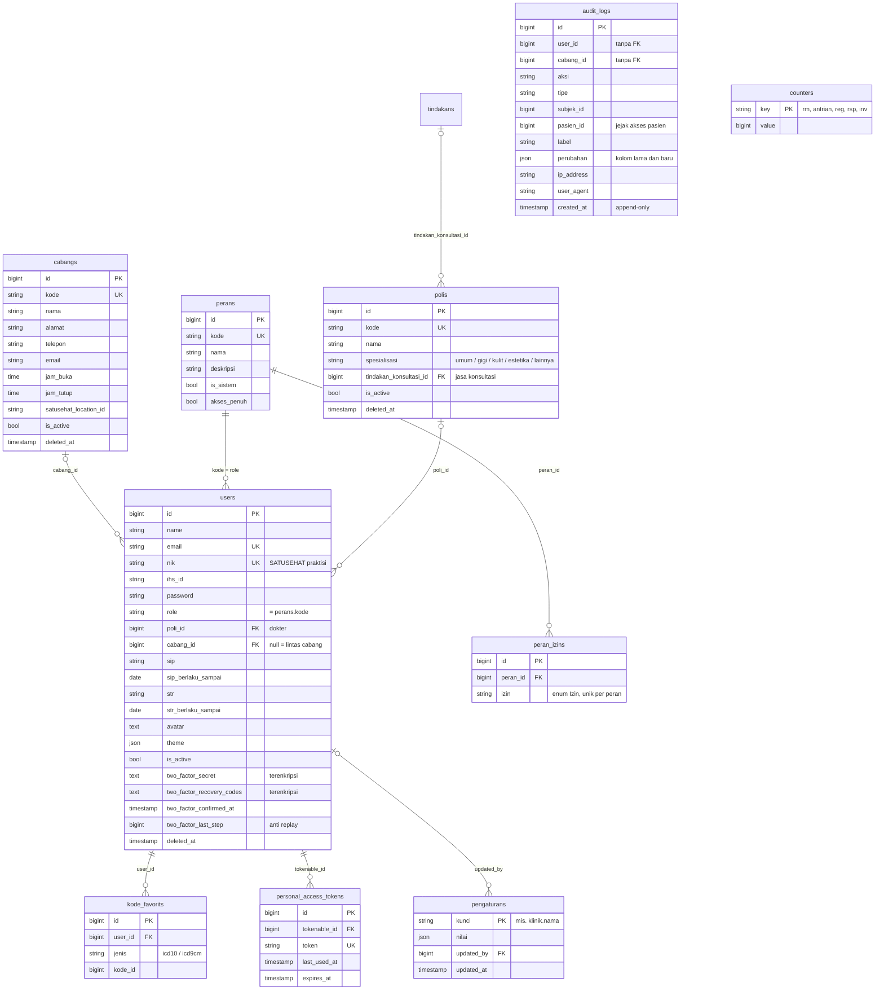
```mermaid
erDiagram
    cabangs |o--o{ users : "cabang_id"
    perans ||--o{ peran_izins : "peran_id"
    perans ||--o{ users : "kode = role"
    polis |o--o{ users : "poli_id"
    tindakans |o--o{ polis : "tindakan_konsultasi_id"
    users ||--o{ kode_favorits : "user_id"
    users ||--o{ personal_access_tokens : "tokenable_id"
    users |o--o{ pengaturans : "updated_by"

    cabangs {
        bigint id PK
        string kode UK
        string nama
        string alamat
        string telepon
        string email
        time jam_buka
        time jam_tutup
        string satusehat_location_id
        bool is_active
        timestamp deleted_at
    }
    users {
        bigint id PK
        string name
        string email UK
        string nik UK "SATUSEHAT praktisi"
        string ihs_id
        string password
        string role "= perans.kode"
        bigint poli_id FK "dokter"
        bigint cabang_id FK "null = lintas cabang"
        string sip
        date sip_berlaku_sampai
        string str
        date str_berlaku_sampai
        text avatar
        json theme
        bool is_active
        text two_factor_secret "terenkripsi"
        text two_factor_recovery_codes "terenkripsi"
        timestamp two_factor_confirmed_at
        bigint two_factor_last_step "anti replay"
        timestamp deleted_at
    }
    perans {
        bigint id PK
        string kode UK
        string nama
        string deskripsi
        bool is_sistem
        bool akses_penuh
    }
    peran_izins {
        bigint id PK
        bigint peran_id FK
        string izin "enum Izin, unik per peran"
    }
    polis {
        bigint id PK
        string kode UK
        string nama
        string spesialisasi "umum / gigi / kulit / estetika / lainnya"
        bigint tindakan_konsultasi_id FK "jasa konsultasi"
        bool is_active
        timestamp deleted_at
    }
    kode_favorits {
        bigint id PK
        bigint user_id FK
        string jenis "icd10 / icd9cm"
        bigint kode_id
    }
    personal_access_tokens {
        bigint id PK
        bigint tokenable_id FK
        string token UK
        timestamp last_used_at
        timestamp expires_at
    }
    pengaturans {
        string kunci PK "mis. klinik.nama"
        json nilai
        bigint updated_by FK
        timestamp updated_at
    }
    audit_logs {
        bigint id PK
        bigint user_id "tanpa FK"
        bigint cabang_id "tanpa FK"
        string aksi
        string tipe
        bigint subjek_id
        bigint pasien_id "jejak akses pasien"
        string label
        json perubahan "kolom lama dan baru"
        string ip_address
        string user_agent
        timestamp created_at "append-only"
    }
    counters {
        string key PK "rm, antrian, reg, rsp, inv"
        bigint value
    }
```

Tabel bawaan Laravel yang tidak digambar: `jobs`, `job_batches`, `failed_jobs`, `cache`, `cache_locks`, `sessions`,
`password_reset_tokens`.

### 6.2 Katalog treatment & master data

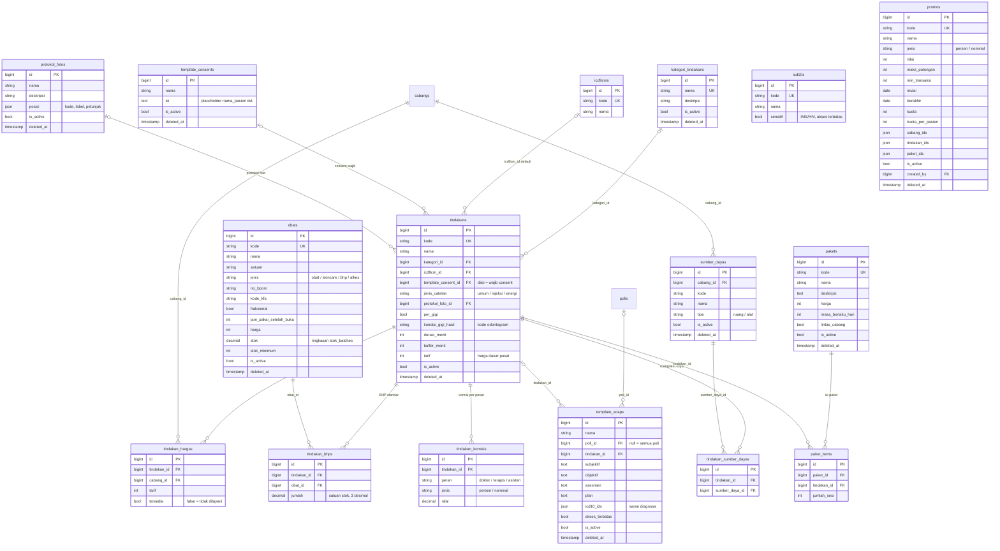
```mermaid
erDiagram
    kategori_tindakans |o--o{ tindakans : "kategori_id"
    icd9cms |o--o{ tindakans : "icd9cm_id default"
    template_consents |o--o{ tindakans : "consent wajib"
    protokol_fotos |o--o{ tindakans : "protokol foto"
    tindakans ||--o{ tindakan_hargas : "harga per cabang"
    cabangs ||--o{ tindakan_hargas : "cabang_id"
    tindakans ||--o{ tindakan_bhps : "BHP standar"
    obats ||--o{ tindakan_bhps : "obat_id"
    tindakans ||--o{ tindakan_komisis : "komisi per peran"
    tindakans ||--o{ tindakan_sumber_dayas : "ruang/alat wajib"
    sumber_dayas ||--o{ tindakan_sumber_dayas : "sumber_daya_id"
    cabangs ||--o{ sumber_dayas : "cabang_id"
    polis |o--o{ template_soaps : "poli_id"
    tindakans |o--o{ template_soaps : "tindakan_id"
    pakets ||--o{ paket_items : "isi paket"
    tindakans ||--o{ paket_items : "tindakan_id"

    tindakans {
        bigint id PK
        string kode UK
        string nama
        bigint kategori_id FK
        bigint icd9cm_id FK
        bigint template_consent_id FK "diisi = wajib consent"
        string jenis_catatan "umum / injeksi / energi"
        bigint protokol_foto_id FK
        bool per_gigi
        string kondisi_gigi_hasil "kode odontogram"
        int durasi_menit
        int buffer_menit
        int tarif "harga dasar pusat"
        bool is_active
        timestamp deleted_at
    }
    kategori_tindakans {
        bigint id PK
        string nama UK
        string deskripsi
        bool is_active
        timestamp deleted_at
    }
    tindakan_hargas {
        bigint id PK
        bigint tindakan_id FK
        bigint cabang_id FK
        int tarif
        bool tersedia "false = tidak dilayani"
    }
    tindakan_bhps {
        bigint id PK
        bigint tindakan_id FK
        bigint obat_id FK
        decimal jumlah "satuan stok, 3 desimal"
    }
    tindakan_komisis {
        bigint id PK
        bigint tindakan_id FK
        string peran "dokter / terapis / asisten"
        string jenis "persen / nominal"
        decimal nilai
    }
    sumber_dayas {
        bigint id PK
        bigint cabang_id FK
        string kode
        string nama
        string tipe "ruang / alat"
        bool is_active
        timestamp deleted_at
    }
    tindakan_sumber_dayas {
        bigint id PK
        bigint tindakan_id FK
        bigint sumber_daya_id FK
    }
    icd10s {
        bigint id PK
        string kode UK
        string nama
        bool sensitif "IMS/HIV, akses terbatas"
    }
    icd9cms {
        bigint id PK
        string kode UK
        string nama
    }
    obats {
        bigint id PK
        string kode UK
        string nama
        string satuan
        string jenis "obat / skincare / bhp / alkes"
        string no_bpom
        string kode_kfa
        bool fraksional
        int jam_pakai_setelah_buka
        int harga
        decimal stok "ringkasan stok_batches"
        int stok_minimum
        bool is_active
        timestamp deleted_at
    }
    template_soaps {
        bigint id PK
        string nama
        bigint poli_id FK "null = semua poli"
        bigint tindakan_id FK
        text subjektif
        text objektif
        text asesmen
        text plan
        json icd10_ids "saran diagnosa"
        bool akses_terbatas
        bool is_active
        timestamp deleted_at
    }
    template_consents {
        bigint id PK
        string nama
        text isi "placeholder nama_pasien dst."
        bool is_active
        timestamp deleted_at
    }
    protokol_fotos {
        bigint id PK
        string nama
        string deskripsi
        json posisi "kode, label, petunjuk"
        bool is_active
        timestamp deleted_at
    }
    pakets {
        bigint id PK
        string kode UK
        string nama
        text deskripsi
        int harga
        int masa_berlaku_hari
        bool lintas_cabang
        bool is_active
        timestamp deleted_at
    }
    paket_items {
        bigint id PK
        bigint paket_id FK
        bigint tindakan_id FK
        int jumlah_sesi
    }
    promos {
        bigint id PK
        string kode UK
        string nama
        string jenis "persen / nominal"
        int nilai
        int maks_potongan
        int min_transaksi
        date mulai
        date berakhir
        int kuota
        int kuota_per_pasien
        json cabang_ids
        json tindakan_ids
        json paket_ids
        bool is_active
        bigint created_by FK
        timestamp deleted_at
    }
```

### 6.3 Booking & jadwal

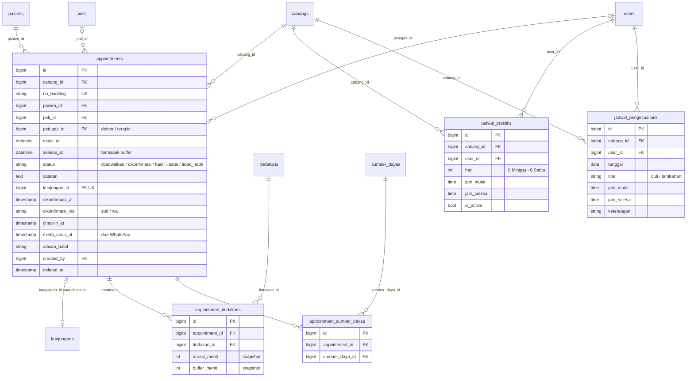
```mermaid
erDiagram
    cabangs ||--o{ appointments : "cabang_id"
    pasiens ||--o{ appointments : "pasien_id"
    polis |o--o{ appointments : "poli_id"
    users |o--o{ appointments : "petugas_id"
    appointments |o--o| kunjungans : "kunjungan_id saat check-in"
    appointments ||--o{ appointment_tindakans : "treatment"
    tindakans ||--o{ appointment_tindakans : "tindakan_id"
    appointments ||--o{ appointment_sumber_dayas : "ruang/alat"
    sumber_dayas ||--o{ appointment_sumber_dayas : "sumber_daya_id"
    users ||--o{ jadwal_praktiks : "user_id"
    cabangs ||--o{ jadwal_praktiks : "cabang_id"
    users ||--o{ jadwal_pengecualians : "user_id"
    cabangs ||--o{ jadwal_pengecualians : "cabang_id"

    appointments {
        bigint id PK
        bigint cabang_id FK
        string no_booking UK
        bigint pasien_id FK
        bigint poli_id FK
        bigint petugas_id FK "dokter / terapis"
        datetime mulai_at
        datetime selesai_at "termasuk buffer"
        string status "dijadwalkan / dikonfirmasi / hadir / batal / tidak_hadir"
        text catatan
        bigint kunjungan_id FK, UK
        timestamp dikonfirmasi_at
        string dikonfirmasi_via "staf / wa"
        timestamp checkin_at
        timestamp minta_ubah_at "dari WhatsApp"
        string alasan_batal
        bigint created_by FK
        timestamp deleted_at
    }
    appointment_tindakans {
        bigint id PK
        bigint appointment_id FK
        bigint tindakan_id FK
        int durasi_menit "snapshot"
        int buffer_menit "snapshot"
    }
    appointment_sumber_dayas {
        bigint id PK
        bigint appointment_id FK
        bigint sumber_daya_id FK
    }
    jadwal_praktiks {
        bigint id PK
        bigint cabang_id FK
        bigint user_id FK
        int hari "0 Minggu - 6 Sabtu"
        time jam_mulai
        time jam_selesai
        bool is_active
    }
    jadwal_pengecualians {
        bigint id PK
        bigint cabang_id FK
        bigint user_id FK
        date tanggal
        string tipe "cuti / tambahan"
        time jam_mulai
        time jam_selesai
        string keterangan
    }
```

### 6.4 Kunjungan & rekam medis (RME)

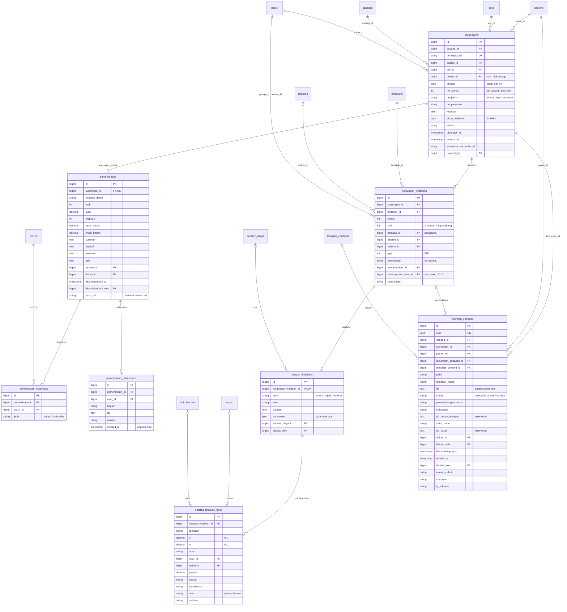
```mermaid
erDiagram
    pasiens ||--o{ kunjungans : "pasien_id"
    polis ||--o{ kunjungans : "poli_id"
    cabangs ||--o{ kunjungans : "cabang_id"
    users |o--o{ kunjungans : "dokter_id"
    kunjungans ||--o| pemeriksaans : "kunjungan_id unik"
    pemeriksaans ||--o{ pemeriksaan_diagnosas : "diagnosa"
    icd10s ||--o{ pemeriksaan_diagnosas : "icd10_id"
    pemeriksaans ||--o{ pemeriksaan_addendums : "addendum"
    kunjungans ||--o{ kunjungan_tindakans : "tindakan"
    tindakans ||--o{ kunjungan_tindakans : "tindakan_id"
    icd9cms |o--o{ kunjungan_tindakans : "icd9cm_id"
    users |o--o{ kunjungan_tindakans : "petugas_id, asisten_id"
    kunjungan_tindakans ||--o| catatan_tindakans : "catatan"
    sumber_dayas |o--o{ catatan_tindakans : "alat"
    catatan_tindakans ||--o{ catatan_tindakan_titiks : "titik face chart"
    obats |o--o{ catatan_tindakan_titiks : "produk"
    stok_batches |o--o{ catatan_tindakan_titiks : "batch"
    kunjungans ||--o{ informed_consents : "kunjungan_id"
    pasiens ||--o{ informed_consents : "pasien_id"
    kunjungan_tindakans |o--o{ informed_consents : "per tindakan"
    template_consents |o--o{ informed_consents : "naskah"

    kunjungans {
        bigint id PK
        bigint cabang_id FK
        string no_registrasi UK
        bigint pasien_id FK
        bigint poli_id FK
        bigint dokter_id FK "null = dokter jaga"
        date tanggal "selalu hari ini"
        int no_antrian "per cabang, poli, hari"
        string penjamin "umum / bpjs / asuransi"
        string no_penjamin
        text keluhan
        bool akses_terbatas "IMS/HIV"
        string status
        timestamp dipanggil_at
        timestamp selesai_at
        string satusehat_encounter_id
        bigint created_by FK
    }
    pemeriksaans {
        bigint id PK
        bigint kunjungan_id FK, UK
        string tekanan_darah
        int nadi
        decimal suhu
        int respirasi
        decimal berat_badan
        decimal tinggi_badan
        text subjektif
        text objektif
        text asesmen
        text plan
        bigint perawat_id FK
        bigint dokter_id FK
        timestamp ditandatangani_at
        bigint ditandatangani_oleh FK
        string hash_ttd "terkunci setelah ttd"
    }
    pemeriksaan_diagnosas {
        bigint id PK
        bigint pemeriksaan_id FK
        bigint icd10_id FK
        string jenis "primer / sekunder"
    }
    pemeriksaan_addendums {
        bigint id PK
        bigint pemeriksaan_id FK
        bigint user_id FK
        string bagian
        text isi
        string alasan
        timestamp created_at "append-only"
    }
    kunjungan_tindakans {
        bigint id PK
        bigint kunjungan_id FK
        bigint tindakan_id FK
        int jumlah
        int tarif "snapshot harga cabang"
        bigint petugas_id FK "pelaksana"
        bigint asisten_id FK
        bigint icd9cm_id FK
        int gigi "FDI"
        string permukaan "M/O/D/B/L"
        bigint rencana_item_id FK
        bigint paket_pasien_item_id FK "sesi paket, Rp 0"
        string keterangan
    }
    catatan_tindakans {
        bigint id PK
        bigint kunjungan_tindakan_id FK, UK
        string jenis "umum / injeksi / energi"
        string area
        text catatan
        json parameter "parameter alat"
        bigint sumber_daya_id FK
        bigint dicatat_oleh FK
    }
    catatan_tindakan_titiks {
        bigint id PK
        bigint catatan_tindakan_id FK
        string tampilan
        decimal x "0..1"
        decimal y "0..1"
        string area
        bigint obat_id FK
        bigint batch_id FK
        decimal jumlah
        string satuan
        string kedalaman
        string alat "jarum / kanula"
        string catatan
    }
    informed_consents {
        bigint id PK
        uuid uuid UK
        bigint cabang_id FK
        bigint kunjungan_id FK
        bigint pasien_id FK
        bigint kunjungan_tindakan_id FK
        bigint template_consent_id FK
        string judul
        string tindakan_nama
        text isi "snapshot naskah"
        string status "disetujui / ditolak / dicabut"
        string penandatangan_nama
        string hubungan
        text ttd_penandatangan "terenkripsi"
        string saksi_nama
        text ttd_saksi "terenkripsi"
        bigint dokter_id FK
        bigint dibuat_oleh FK
        timestamp ditandatangani_at
        timestamp dicabut_at
        bigint dicabut_oleh FK
        string alasan_cabut
        string checksum
        string ip_address
    }
```

### 6.5 Data pasien, persetujuan & berkas

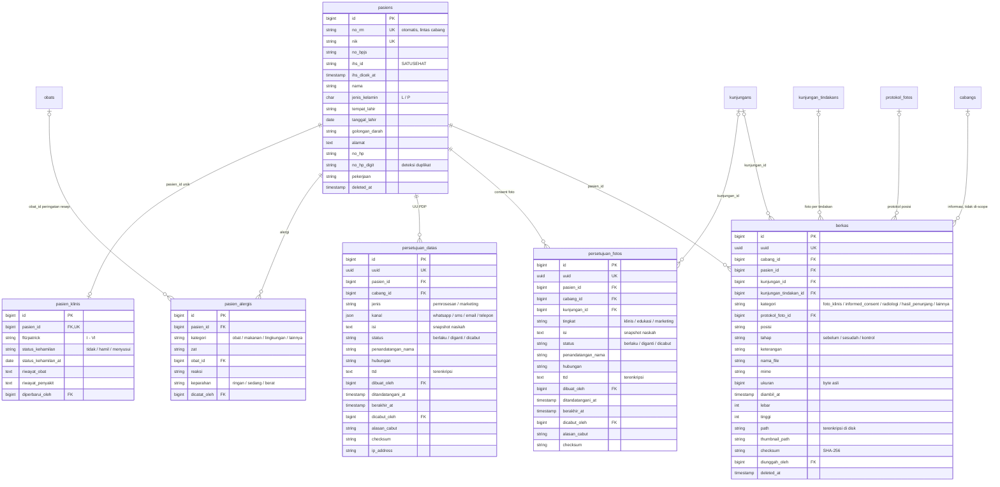
```mermaid
erDiagram
    pasiens ||--o| pasien_klinis : "pasien_id unik"
    pasiens ||--o{ pasien_alergis : "alergi"
    obats |o--o{ pasien_alergis : "obat_id peringatan resep"
    pasiens ||--o{ persetujuan_datas : "UU PDP"
    pasiens ||--o{ persetujuan_fotos : "consent foto"
    kunjungans |o--o{ persetujuan_fotos : "kunjungan_id"
    pasiens ||--o{ berkas : "pasien_id"
    kunjungans |o--o{ berkas : "kunjungan_id"
    kunjungan_tindakans |o--o{ berkas : "foto per tindakan"
    protokol_fotos |o--o{ berkas : "protokol posisi"
    cabangs |o--o{ berkas : "informasi, tidak di-scope"

    pasiens {
        bigint id PK
        string no_rm UK "otomatis, lintas cabang"
        string nik UK
        string no_bpjs
        string ihs_id "SATUSEHAT"
        timestamp ihs_dicek_at
        string nama
        char jenis_kelamin "L / P"
        string tempat_lahir
        date tanggal_lahir
        string golongan_darah
        text alamat
        string no_hp
        string no_hp_digit "deteksi duplikat"
        string pekerjaan
        timestamp deleted_at
    }
    pasien_klinis {
        bigint id PK
        bigint pasien_id FK, UK
        string fitzpatrick "I - VI"
        string status_kehamilan "tidak / hamil / menyusui"
        date status_kehamilan_at
        text riwayat_obat
        text riwayat_penyakit
        bigint diperbarui_oleh FK
    }
    pasien_alergis {
        bigint id PK
        bigint pasien_id FK
        string kategori "obat / makanan / lingkungan / lainnya"
        string zat
        bigint obat_id FK
        string reaksi
        string keparahan "ringan / sedang / berat"
        bigint dicatat_oleh FK
    }
    persetujuan_datas {
        bigint id PK
        uuid uuid UK
        bigint pasien_id FK
        bigint cabang_id FK
        string jenis "pemrosesan / marketing"
        json kanal "whatsapp / sms / email / telepon"
        text isi "snapshot naskah"
        string status "berlaku / diganti / dicabut"
        string penandatangan_nama
        string hubungan
        text ttd "terenkripsi"
        bigint dibuat_oleh FK
        timestamp ditandatangani_at
        timestamp berakhir_at
        bigint dicabut_oleh FK
        string alasan_cabut
        string checksum
        string ip_address
    }
    persetujuan_fotos {
        bigint id PK
        uuid uuid UK
        bigint pasien_id FK
        bigint cabang_id FK
        bigint kunjungan_id FK
        string tingkat "klinis / edukasi / marketing"
        text isi "snapshot naskah"
        string status "berlaku / diganti / dicabut"
        string penandatangan_nama
        string hubungan
        text ttd "terenkripsi"
        bigint dibuat_oleh FK
        timestamp ditandatangani_at
        timestamp berakhir_at
        bigint dicabut_oleh FK
        string alasan_cabut
        string checksum
    }
    berkas {
        bigint id PK
        uuid uuid UK
        bigint cabang_id FK
        bigint pasien_id FK
        bigint kunjungan_id FK
        bigint kunjungan_tindakan_id FK
        string kategori "foto_klinis / informed_consent / radiologi / hasil_penunjang / lainnya"
        bigint protokol_foto_id FK
        string posisi
        string tahap "sebelum / sesudah / kontrol"
        string keterangan
        string nama_file
        string mime
        bigint ukuran "byte asli"
        timestamp diambil_at
        int lebar
        int tinggi
        string path "terenkripsi di disk"
        string thumbnail_path
        string checksum "SHA-256"
        bigint diunggah_oleh FK
        timestamp deleted_at
    }
```

### 6.6 Kedokteran gigi

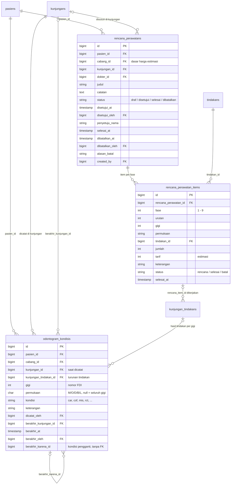
```mermaid
erDiagram
    pasiens ||--o{ odontogram_kondisis : "pasien_id"
    kunjungans ||--o{ odontogram_kondisis : "dicatat di kunjungan"
    kunjungans |o--o{ odontogram_kondisis : "berakhir_kunjungan_id"
    kunjungan_tindakans |o--o{ odontogram_kondisis : "hasil tindakan per gigi"
    odontogram_kondisis |o--o{ odontogram_kondisis : "berakhir_karena_id"
    pasiens ||--o{ rencana_perawatans : "pasien_id"
    kunjungans |o--o{ rencana_perawatans : "disusun di kunjungan"
    rencana_perawatans ||--o{ rencana_perawatan_items : "item per fase"
    tindakans ||--o{ rencana_perawatan_items : "tindakan_id"
    rencana_perawatan_items |o--o{ kunjungan_tindakans : "rencana_item_id dikerjakan"

    odontogram_kondisis {
        bigint id PK
        bigint pasien_id FK
        bigint cabang_id FK
        bigint kunjungan_id FK "saat dicatat"
        bigint kunjungan_tindakan_id FK "turunan tindakan"
        int gigi "nomor FDI"
        char permukaan "M/O/D/B/L, null = seluruh gigi"
        string kondisi "car, cof, mis, rct, ..."
        string keterangan
        bigint dicatat_oleh FK
        bigint berakhir_kunjungan_id FK
        timestamp berakhir_at
        bigint berakhir_oleh FK
        bigint berakhir_karena_id "kondisi pengganti, tanpa FK"
    }
    rencana_perawatans {
        bigint id PK
        bigint pasien_id FK
        bigint cabang_id FK "dasar harga estimasi"
        bigint kunjungan_id FK
        bigint dokter_id FK
        string judul
        text catatan
        string status "draf / disetujui / selesai / dibatalkan"
        timestamp disetujui_at
        bigint disetujui_oleh FK
        string penyetuju_nama
        timestamp selesai_at
        timestamp dibatalkan_at
        bigint dibatalkan_oleh FK
        string alasan_batal
        bigint created_by FK
    }
    rencana_perawatan_items {
        bigint id PK
        bigint rencana_perawatan_id FK
        int fase "1 - 9"
        int urutan
        int gigi
        string permukaan
        bigint tindakan_id FK
        int jumlah
        int tarif "estimasi"
        string keterangan
        string status "rencana / selesai / batal"
        timestamp selesai_at
    }
```

### 6.7 Kasir, paket & promo

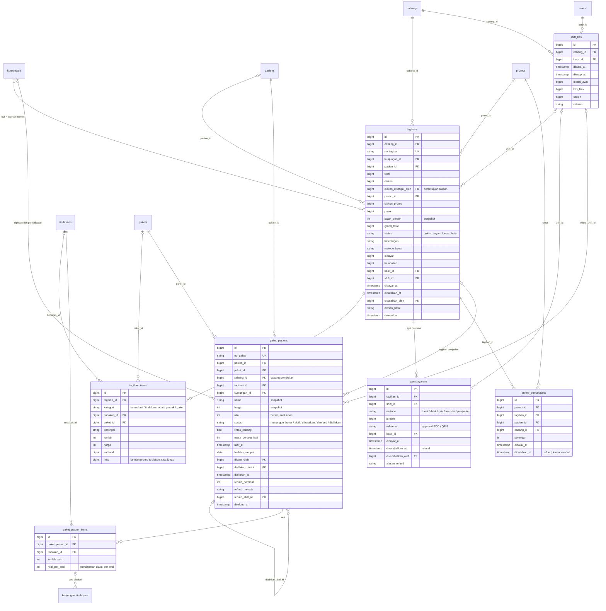
```mermaid
erDiagram
    kunjungans |o--o{ tagihans : "null = tagihan mandiri"
    pasiens |o--o{ tagihans : "pasien_id"
    cabangs ||--o{ tagihans : "cabang_id"
    tagihans ||--o{ tagihan_items : "baris"
    tindakans |o--o{ tagihan_items : "tindakan_id"
    pakets |o--o{ tagihan_items : "paket_id"
    tagihans ||--o{ pembayarans : "split payment"
    cabangs ||--o{ shift_kas : "cabang_id"
    users ||--o{ shift_kas : "kasir_id"
    shift_kas |o--o{ tagihans : "shift_id"
    shift_kas |o--o{ pembayarans : "shift_id"
    promos |o--o{ tagihans : "promo_id"
    promos ||--o{ promo_pemakaians : "kuota"
    tagihans ||--o{ promo_pemakaians : "tagihan_id"
    pakets ||--o{ paket_pasiens : "paket_id"
    pasiens ||--o{ paket_pasiens : "pasien_id"
    tagihans |o--o{ paket_pasiens : "tagihan penjualan"
    kunjungans |o--o{ paket_pasiens : "dipesan dari pemeriksaan"
    paket_pasiens |o--o{ paket_pasiens : "dialihkan_dari_id"
    shift_kas |o--o{ paket_pasiens : "refund_shift_id"
    paket_pasiens ||--o{ paket_pasien_items : "sesi"
    tindakans ||--o{ paket_pasien_items : "tindakan_id"
    paket_pasien_items |o--o{ kunjungan_tindakans : "sesi dipakai"

    tagihans {
        bigint id PK
        bigint cabang_id FK
        string no_tagihan UK
        bigint kunjungan_id FK
        bigint pasien_id FK
        bigint total
        bigint diskon
        bigint diskon_disetujui_oleh FK "persetujuan atasan"
        bigint promo_id FK
        bigint diskon_promo
        bigint pajak
        int pajak_persen "snapshot"
        bigint grand_total
        string status "belum_bayar / lunas / batal"
        string keterangan
        string metode_bayar
        bigint dibayar
        bigint kembalian
        bigint kasir_id FK
        bigint shift_id FK
        timestamp dibayar_at
        timestamp dibatalkan_at
        bigint dibatalkan_oleh FK
        string alasan_batal
        timestamp deleted_at
    }
    tagihan_items {
        bigint id PK
        bigint tagihan_id FK
        string kategori "konsultasi / tindakan / obat / produk / paket"
        bigint tindakan_id FK
        bigint paket_id FK
        string deskripsi
        int jumlah
        int harga
        bigint subtotal
        bigint neto "setelah promo & diskon, saat lunas"
    }
    pembayarans {
        bigint id PK
        bigint tagihan_id FK
        bigint shift_id FK
        string metode "tunai / debit / qris / transfer / penjamin"
        bigint jumlah
        string referensi "approval EDC / QRIS"
        bigint kasir_id FK
        timestamp dibayar_at
        timestamp dikembalikan_at "refund"
        bigint dikembalikan_oleh FK
        string alasan_refund
    }
    shift_kas {
        bigint id PK
        bigint cabang_id FK
        bigint kasir_id FK
        timestamp dibuka_at
        timestamp ditutup_at
        bigint modal_awal
        bigint kas_fisik
        bigint selisih
        string catatan
    }
    paket_pasiens {
        bigint id PK
        string no_paket UK
        bigint pasien_id FK
        bigint paket_id FK
        bigint cabang_id FK "cabang pembelian"
        bigint tagihan_id FK
        bigint kunjungan_id FK
        string nama "snapshot"
        int harga "snapshot"
        int nilai "bersih, saat lunas"
        string status "menunggu_bayar / aktif / dibatalkan / direfund / dialihkan"
        bool lintas_cabang
        int masa_berlaku_hari
        timestamp aktif_at
        date berlaku_sampai
        bigint dibuat_oleh FK
        bigint dialihkan_dari_id FK
        timestamp dialihkan_at
        int refund_nominal
        string refund_metode
        bigint refund_shift_id FK
        timestamp direfund_at
    }
    paket_pasien_items {
        bigint id PK
        bigint paket_pasien_id FK
        bigint tindakan_id FK
        int jumlah_sesi
        int nilai_per_sesi "pendapatan diakui per sesi"
    }
    promo_pemakaians {
        bigint id PK
        bigint promo_id FK
        bigint tagihan_id FK
        bigint pasien_id FK
        bigint cabang_id FK
        int potongan
        timestamp dipakai_at
        timestamp dibatalkan_at "refund, kuota kembali"
    }
```

### 6.8 Farmasi & inventori

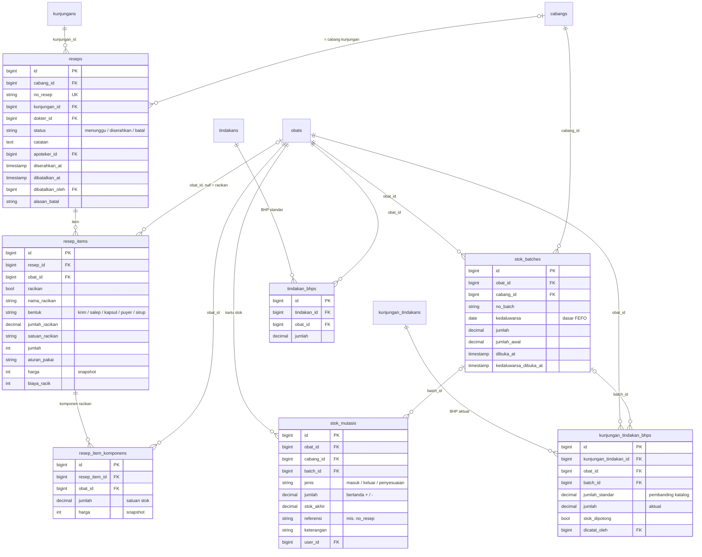
```mermaid
erDiagram
    kunjungans ||--o{ reseps : "kunjungan_id"
    cabangs |o--o{ reseps : "= cabang kunjungan"
    reseps ||--o{ resep_items : "item"
    obats |o--o{ resep_items : "obat_id, null = racikan"
    resep_items ||--o{ resep_item_komponens : "komponen racikan"
    obats ||--o{ resep_item_komponens : "obat_id"
    obats ||--o{ stok_batches : "obat_id"
    cabangs ||--o{ stok_batches : "cabang_id"
    obats ||--o{ stok_mutasis : "kartu stok"
    stok_batches |o--o{ stok_mutasis : "batch_id"
    kunjungan_tindakans ||--o{ kunjungan_tindakan_bhps : "BHP aktual"
    obats ||--o{ kunjungan_tindakan_bhps : "obat_id"
    stok_batches |o--o{ kunjungan_tindakan_bhps : "batch_id"
    tindakans ||--o{ tindakan_bhps : "BHP standar"
    obats ||--o{ tindakan_bhps : "obat_id"

    reseps {
        bigint id PK
        bigint cabang_id FK
        string no_resep UK
        bigint kunjungan_id FK
        bigint dokter_id FK
        string status "menunggu / diserahkan / batal"
        text catatan
        bigint apoteker_id FK
        timestamp diserahkan_at
        timestamp dibatalkan_at
        bigint dibatalkan_oleh FK
        string alasan_batal
    }
    resep_items {
        bigint id PK
        bigint resep_id FK
        bigint obat_id FK
        bool racikan
        string nama_racikan
        string bentuk "krim / salep / kapsul / puyer / sirup"
        decimal jumlah_racikan
        string satuan_racikan
        int jumlah
        string aturan_pakai
        int harga "snapshot"
        int biaya_racik
    }
    resep_item_komponens {
        bigint id PK
        bigint resep_item_id FK
        bigint obat_id FK
        decimal jumlah "satuan stok"
        int harga "snapshot"
    }
    stok_batches {
        bigint id PK
        bigint obat_id FK
        bigint cabang_id FK
        string no_batch
        date kedaluwarsa "dasar FEFO"
        decimal jumlah
        decimal jumlah_awal
        timestamp dibuka_at
        timestamp kedaluwarsa_dibuka_at
    }
    stok_mutasis {
        bigint id PK
        bigint obat_id FK
        bigint cabang_id FK
        bigint batch_id FK
        string jenis "masuk / keluar / penyesuaian"
        decimal jumlah "bertanda + / -"
        decimal stok_akhir
        string referensi "mis. no_resep"
        string keterangan
        bigint user_id FK
    }
    kunjungan_tindakan_bhps {
        bigint id PK
        bigint kunjungan_tindakan_id FK
        bigint obat_id FK
        bigint batch_id FK
        decimal jumlah_standar "pembanding katalog"
        decimal jumlah "aktual"
        bool stok_dipotong
        bigint dicatat_oleh FK
    }
    tindakan_bhps {
        bigint id PK
        bigint tindakan_id FK
        bigint obat_id FK
        decimal jumlah
    }
```

### 6.9 Komisi & jasa medis

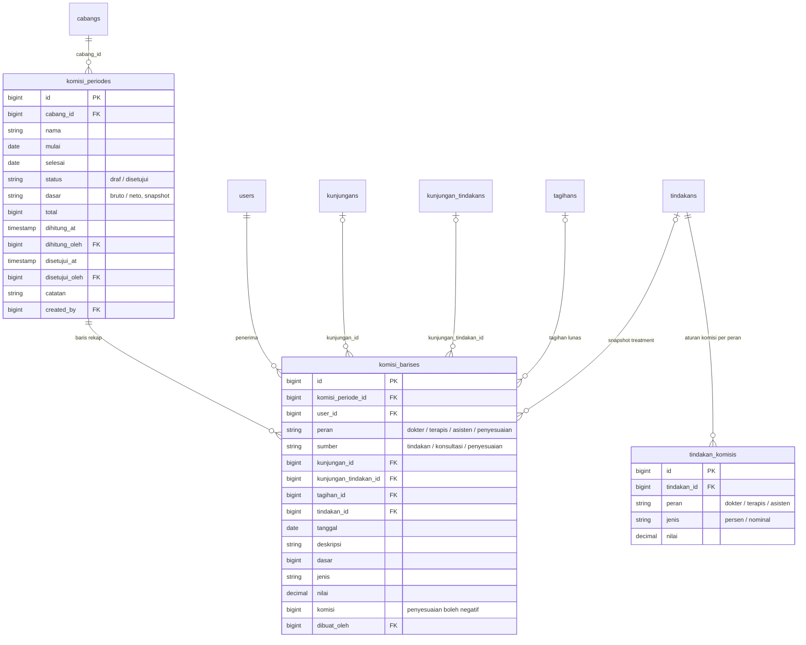
```mermaid
erDiagram
    tindakans ||--o{ tindakan_komisis : "aturan komisi per peran"
    cabangs ||--o{ komisi_periodes : "cabang_id"
    komisi_periodes ||--o{ komisi_barises : "baris rekap"
    users ||--o{ komisi_barises : "penerima"
    kunjungans |o--o{ komisi_barises : "kunjungan_id"
    kunjungan_tindakans |o--o{ komisi_barises : "kunjungan_tindakan_id"
    tagihans |o--o{ komisi_barises : "tagihan lunas"
    tindakans |o--o{ komisi_barises : "snapshot treatment"

    tindakan_komisis {
        bigint id PK
        bigint tindakan_id FK
        string peran "dokter / terapis / asisten"
        string jenis "persen / nominal"
        decimal nilai
    }
    komisi_periodes {
        bigint id PK
        bigint cabang_id FK
        string nama
        date mulai
        date selesai
        string status "draf / disetujui"
        string dasar "bruto / neto, snapshot"
        bigint total
        timestamp dihitung_at
        bigint dihitung_oleh FK
        timestamp disetujui_at
        bigint disetujui_oleh FK
        string catatan
        bigint created_by FK
    }
    komisi_barises {
        bigint id PK
        bigint komisi_periode_id FK
        bigint user_id FK
        string peran "dokter / terapis / asisten / penyesuaian"
        string sumber "tindakan / konsultasi / penyesuaian"
        bigint kunjungan_id FK
        bigint kunjungan_tindakan_id FK
        bigint tagihan_id FK
        bigint tindakan_id FK
        date tanggal
        string deskripsi
        bigint dasar
        string jenis
        decimal nilai
        bigint komisi "penyesuaian boleh negatif"
        bigint dibuat_oleh FK
    }
```

### 6.10 Integrasi (SATUSEHAT & WhatsApp)

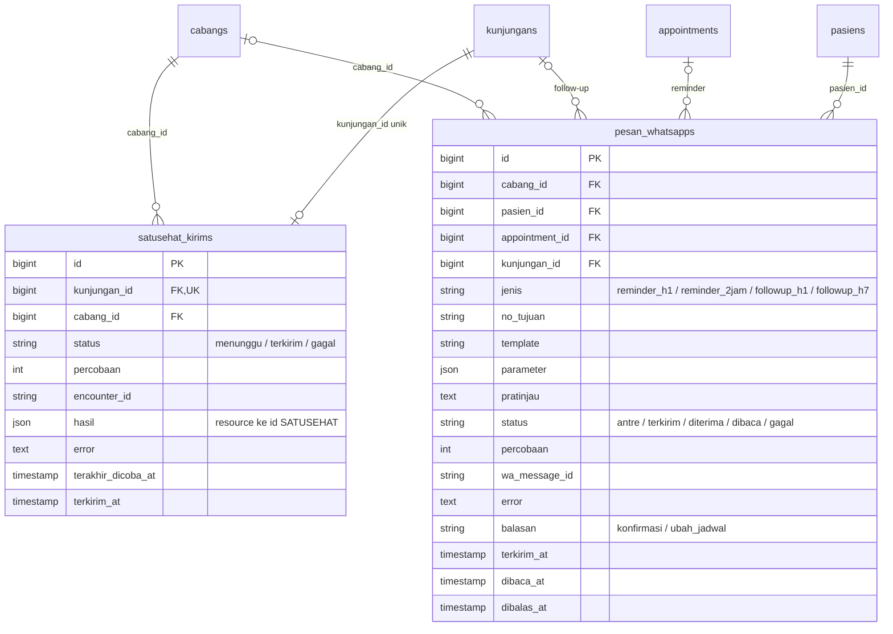
```mermaid
erDiagram
    kunjungans ||--o| satusehat_kirims : "kunjungan_id unik"
    cabangs ||--o{ satusehat_kirims : "cabang_id"
    pasiens ||--o{ pesan_whatsapps : "pasien_id"
    appointments |o--o{ pesan_whatsapps : "reminder"
    kunjungans |o--o{ pesan_whatsapps : "follow-up"
    cabangs |o--o{ pesan_whatsapps : "cabang_id"

    satusehat_kirims {
        bigint id PK
        bigint kunjungan_id FK, UK
        bigint cabang_id FK
        string status "menunggu / terkirim / gagal"
        int percobaan
        string encounter_id
        json hasil "resource ke id SATUSEHAT"
        text error
        timestamp terakhir_dicoba_at
        timestamp terkirim_at
    }
    pesan_whatsapps {
        bigint id PK
        bigint cabang_id FK
        bigint pasien_id FK
        bigint appointment_id FK
        bigint kunjungan_id FK
        string jenis "reminder_h1 / reminder_2jam / followup_h1 / followup_h7"
        string no_tujuan
        string template
        json parameter
        text pratinjau
        string status "antre / terkirim / diterima / dibaca / gagal"
        int percobaan
        string wa_message_id
        text error
        string balasan "konfirmasi / ubah_jadwal"
        timestamp terkirim_at
        timestamp dibaca_at
        timestamp dibalas_at
    }
```

Unik `(jenis, appointment_id)` dan `(jenis, kunjungan_id)` di `pesan_whatsapps` menjamin tiap jenis pesan terkirim sekali.

---

## Merawat dokumen ini

- Migration baru yang menambah tabel/kolom/relasi → perbarui diagram ERD domain terkait di sini **dan** [03-database.md](03-database.md).
- Perubahan alur atau status (`app/Enums/Status*.php`) → perbarui bagian 2 dan 5.
- Uji render: tempel blok ke [mermaid.live](https://mermaid.live) atau pratinjau Markdown VS Code.
